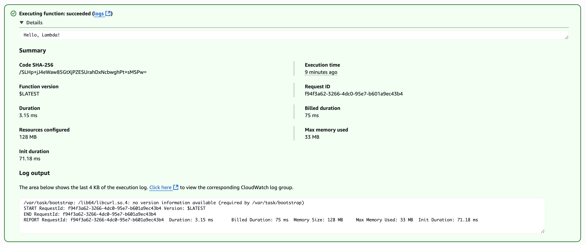

# Hello World in C on AWS Lambda

This is a proof-of-concept for writing AWS Lambda functions in the C programming language.

## Frequently Asked Questions

### Why do this?

Why not?

### No really, why do this?

I believe AWS Lambda is one of Amazon's most significant innovations since the company launched as an online bookstore. Since the original website was written in C, this project serves as an homage to Amazon's history.

### Is the code safe?

Absolutely not. But it works.

### How is this tested?

There is a mock AWS Lambda runtime API implemented in `api.js` using Express.js.

#### Process

1. Build the binary: `make bootstrap`
2. Install express: `npm install`
3. Run the mock API: `node api.js`
4. Run the Lambda: `AWS_LAMBDA_RUNTIME_API=localhost:8080 ./build/bin/bootstrap`

The console for the API should start flowing with logs.

### How fast is it?

Very fast.

